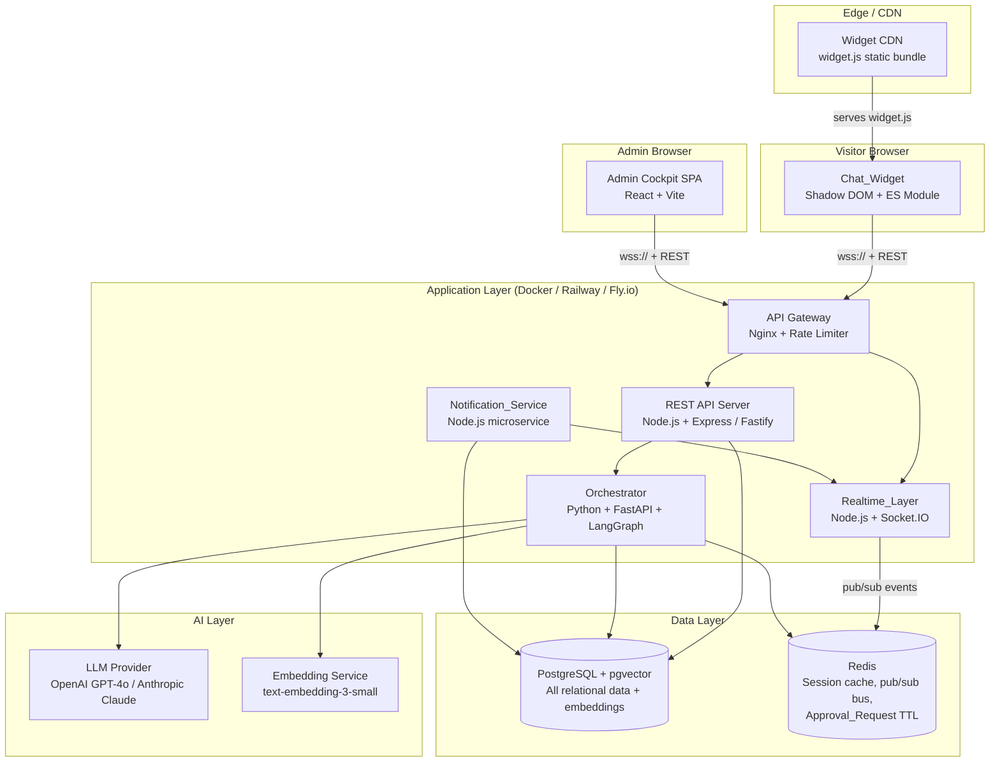
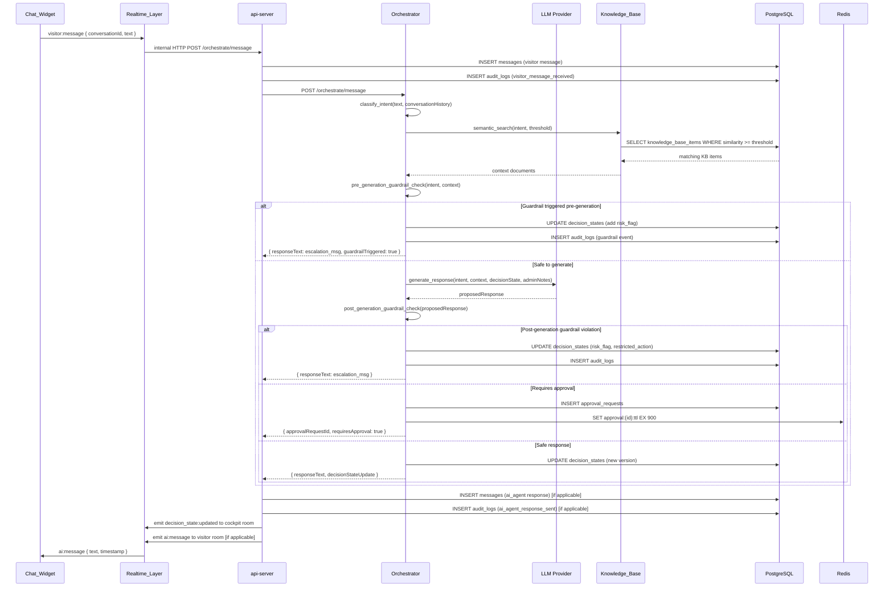

# Design Document: AI Customer Service Cockpit

## Overview

The AI Customer Service Cockpit is a standalone, embeddable web chat system for 5SOffice. Visitors to any 5SOffice webpage can start a chat session via a lightweight JavaScript widget. An AI agent answers questions using an approved knowledge base, enforces business guardrails, and maintains a structured Decision State (J Space) per conversation. Human admins observe and intervene through a purpose-built cockpit dashboard, from silent observation through full takeover.

### Design Goals

- **Isolation**: Zero runtime dependency on the 5S Webapp; deployable as an independent service.
- **Human-in-the-loop first**: Every sensitive action has a human approval path; guardrails are enforced before any message reaches a visitor.
- **Auditability**: Every significant event is append-only logged before the operation is considered complete.
- **Real-time**: Sub-second Decision_State updates to the cockpit; ≤2 s end-to-end message latency.
- **Embeddability**: Single `<script>` tag activation, no namespace pollution, configuration via `data-*` attributes.

### Key Research Findings

- **LLM integration**: LangChain/LangGraph (Python) is the leading framework for multi-step AI agent orchestration with guardrail hook support, tool calling, and structured output. It supports streaming tokens and integrates with OpenAI, Anthropic, and open-source models.
- **Vector store**: pgvector (PostgreSQL extension) eliminates a separate vector DB for MVP, storing embeddings alongside relational data. Supports cosine similarity search with configurable thresholds.
- **Real-time layer**: Socket.IO (Node.js) provides WebSocket with automatic fallback, rooms/namespaces for multi-admin pub/sub, and reconnection with exponential backoff out of the box.
- **Widget isolation**: Shadow DOM + ES Module bundle (Vite build) achieves true CSS and JS isolation from the host page without iframe overhead.
- **Audit log immutability**: PostgreSQL INSERT-only table with a trigger that raises an exception on UPDATE/DELETE enforces append-only semantics at the DB layer.


---

## Architecture

### System Component Diagram



### Deployment Topology

The entire system ships as a monorepo with four deployable units:

| Unit | Runtime | Purpose |
|---|---|---|
| `api-server` | Node.js 20 | REST API + Socket.IO Realtime_Layer |
| `orchestrator` | Python 3.12 | LangGraph AI orchestration, guardrail enforcement |
| `cockpit` | Static SPA | Admin dashboard (served from `api-server` or CDN) |
| `widget` | Static JS bundle | `widget.js` served from CDN |

For MVP, `api-server` and `orchestrator` can run as two containers behind a single Nginx reverse proxy. Redis and PostgreSQL run as managed cloud services (Supabase for Postgres, Upstash for Redis) to minimise ops overhead.


---

## Technology Stack

| Layer | Technology | Rationale |
|---|---|---|
| **Widget frontend** | Vanilla TypeScript + Shadow DOM, bundled with Vite | Zero framework overhead, true CSS/JS isolation from host page. ~15 KB gzip. |
| **Admin Cockpit** | React 18 + TypeScript + Vite + TailwindCSS | Rich component model, excellent Socket.IO client integration, fast hot reload. |
| **REST + WebSocket server** | Node.js 20 + Fastify + Socket.IO | Non-blocking I/O ideal for pub/sub fan-out. Socket.IO handles reconnect, rooms, namespaces. |
| **AI Orchestrator** | Python 3.12 + FastAPI + LangGraph | LangGraph is the leading stateful multi-step agent framework. FastAPI provides async endpoints and OpenAPI spec generation. |
| **LLM** | OpenAI GPT-4o (primary), Claude 3.5 Sonnet (fallback) | GPT-4o for structured output (JSON mode), tool calling, and low latency. Switchable via env var. |
| **Embeddings** | OpenAI text-embedding-3-small | 1536-dim, cost-effective, ~2× better than ada-002. |
| **Database** | PostgreSQL 16 + pgvector extension | Single database for relational data + vector similarity search. Eliminates separate vector DB for MVP. |
| **Cache / Pub-Sub / TTL** | Redis 7 (Upstash for managed) | Session store, Socket.IO adapter for multi-node fan-out, Approval_Request auto-reject TTL via key expiry. |
| **Auth** | JWT (short-lived access token) + refresh token in HttpOnly cookie | Stateless admin auth. Visitor sessions use anonymous UUID stored in localStorage. |
| **Encryption at rest** | PostgreSQL `pgcrypto` AES-256 for PII columns | Phone and email stored as `pgp_sym_encrypt` ciphertext. Decrypted only in application layer with RBAC check. |
| **Reverse proxy** | Nginx | TLS termination, rate limiting (30 msg/min per visitor session), static file serving. |
| **Container** | Docker + Docker Compose (dev), Railway / Fly.io (prod) | Simple, low-cost PaaS deployments for MVP. |
| **Testing** | Vitest (TS), pytest + Hypothesis (Python PBT) | Hypothesis is the Python PBT library. Vitest for widget and cockpit unit tests. |


---

## Components and Interfaces

### 1. Chat_Widget

The widget is a self-contained Shadow DOM component injected by `widget.js`.

**Initialization flow:**
1. Script tag parsed → `widget.js` loads from CDN
2. Reads `data-site`, `data-primary-color`, `data-position` from the `<script>` element
3. Creates a `<div id="csw-root">` appended to `document.body`
4. Attaches a Shadow DOM root to `csw-root`
5. Renders the chat launcher button inside the shadow root
6. On launcher click: opens chat panel, calls `POST /api/v1/conversations` to create a Conversation, connects Socket.IO to the `visitor` namespace

**Key widget interface:**

```typescript
interface WidgetConfig {
  siteId: string;           // data-site attribute
  primaryColor?: string;    // hex color, default #1B4F72
  position?: 'bottom-right' | 'bottom-left'; // default bottom-right
  apiBase: string;          // injected at bundle build time
}

interface VisitorSession {
  visitorId: string;        // anonymous UUID, persisted in localStorage
  conversationId: string;
  socketToken: string;      // short-lived JWT for WS auth
}
```

**Widget → Server communication:**
- REST: `POST /api/v1/conversations`, `POST /api/v1/messages`, `GET /api/v1/conversations/:id/messages`
- WebSocket namespace: `/visitor` — rooms named by `conversationId`

### 2. Realtime_Layer (Socket.IO Server)

Two Socket.IO namespaces:

| Namespace | Clients | Purpose |
|---|---|---|
| `/visitor` | Chat_Widget | Visitor messages in, AI responses out |
| `/cockpit` | Admin Cockpit SPA | Conversation list updates, J Space updates, approval alerts |

**Room convention:** Each Conversation has a room `conv:{conversationId}` in both namespaces. Admin sessions join the cockpit room for their selected conversation. Multiple Admins can join the same room without message duplication (Socket.IO rooms handle fan-out).

**Key socket events:**

```typescript
// Visitor namespace (client → server)
'visitor:message'    { conversationId, text, visitorId }

// Visitor namespace (server → client)
'ai:message'         { conversationId, text, timestamp }
'ai:typing'          { conversationId, typing: boolean }
'conversation:closed' { conversationId, closureMessage }

// Cockpit namespace (server → client)
'conversation:new'         { conversation: ConversationSummary }
'conversation:status'      { conversationId, previousStatus, newStatus }
'decision_state:updated'   { conversationId, decisionState: DecisionState }
'approval:created'         { conversationId, approvalRequest: ApprovalRequest }
'approval:alert'           { conversationId, approvalRequestId, minutesWaiting }
'notification:new_conversation' { conversationId, visitorSummary }
```

The Redis Socket.IO adapter (`@socket.io/redis-adapter`) allows horizontal scaling: multiple `api-server` instances share pub/sub state so a visitor on server A and an admin on server B receive the same events.


### 3. Orchestrator (LangGraph Agent)

The Orchestrator is a Python FastAPI service that receives a `ProcessMessage` request from the `api-server` and runs a LangGraph state graph to produce a response.

**LangGraph graph nodes:**

```
[receive_message]
       ↓
[classify_intent]  →  updates Decision_State.intent
       ↓
[retrieve_knowledge]  →  pgvector similarity search
       ↓
[check_guardrails]  →  pre-generation guardrail scan
       ↓
[generate_response]  →  LLM call with KB context + Decision_State
       ↓
[post_generation_guardrails]  →  final check on generated text
       ↓
[route_response]
  ├── GUARDRAIL_VIOLATED → [handle_violation]
  ├── REQUIRES_APPROVAL  → [create_approval_request]
  └── SAFE               → [send_response]
       ↓
[update_decision_state]
       ↓
[update_audit_log]
```

**Orchestrator REST interface (called by api-server):**

```
POST /orchestrate/message
  Body: { conversationId, messageId, text, visitorId, adminNotes[], interventionLevel, decisionState }
  Returns: { responseText?, approvalRequestId?, decisionStateUpdate, auditEvents[] }

POST /orchestrate/admin-note
  Body: { conversationId, note, adminId }
  Returns: { decisionStateUpdate }

POST /orchestrate/approval-decision
  Body: { approvalRequestId, decision: 'approve'|'edit'|'reject', editedText?, rejectionReason? }
  Returns: { responseText?, auditEvent }

POST /orchestrate/takeover
  Body: { conversationId, adminId, action: 'activate'|'release' }
  Returns: { decisionStateUpdate, auditEvent }

GET /orchestrate/assist
  Query: { conversationId, adminQuery }
  Returns: { assistanceText }
```

### 4. Admin Cockpit (SPA)

React SPA with two main views:

- **Conversation List**: Real-time list of all active/recent conversations, status badge, visitor name, elapsed time. Updates via `conversation:new` and `conversation:status` socket events.
- **Conversation Detail**: Two-panel layout.
  - **Window A (Chat)**: Message transcript + typing indicator + Admin message input (visible only during Takeover) + Admin_Note input + Intervention_Level controls
  - **Window B (J Space)**: Decision_State rendered as structured fields, Approval Panel, Audit Log tab, Lead Info panel

**RBAC-gated UI elements:**

| Permission | Controls shown |
|---|---|
| `view_conversations` | Read-only chat view |
| `add_admin_notes` | Admin_Note input |
| `apply_constraints` | Decision_Constraint panel |
| `approve_requests` | Approval Panel with approve/edit/reject |
| `activate_takeover` | Takeover button |
| `manage_knowledge_base` | KB management routes |
| `configure_system` | System settings routes |
| `view_contact_data` | Visitor name, phone, email, company fields |


### 5. Knowledge_Base Service

Implemented as a module within the Orchestrator service (not a separate deployment for MVP).

**Content ingestion pipeline:**
1. System_Owner creates/edits content via REST API (`POST /api/v1/kb/items`)
2. Content saved to `knowledge_base_items` table with status `draft`
3. On publish: status set to `approved`, embedding generated via OpenAI `text-embedding-3-small`
4. Embedding stored in `knowledge_base_items.embedding` (pgvector `vector(1536)` column)
5. Propagation deadline: 60s; retried up to 3× with exponential backoff

**Retrieval:**
```sql
SELECT id, content, category, similarity_score
FROM knowledge_base_items,
     LATERAL (
       SELECT 1 - (embedding <=> $query_embedding) AS similarity_score
     ) AS sim
WHERE status = 'approved'
  AND similarity_score >= $threshold
ORDER BY similarity_score DESC
LIMIT 5;
```

### 6. Notification_Service

Runs as a module within `api-server`. Uses Redis pub/sub to decouple notification triggers from delivery.

**Notification triggers and SLAs:**

| Event | Target | SLA |
|---|---|---|
| New Conversation | All online admins | 5 seconds |
| Approval_Request created | Admins on that Conversation | 10 seconds |
| Approval_Request unreviewed at 2 min | Admins on that Conversation | First escalation alert |
| Approval_Request unreviewed at 5 min | Admins on that Conversation | Second escalation alert |
| Approval_Request unreviewed at 15 min | System | Auto-reject trigger |

**Delivery mechanism:** Socket.IO `cockpit` namespace event + browser Push API (Web Push Protocol via `web-push` library) when admin has granted notification permission.

**Auto-reject via Redis TTL:**
When an Approval_Request is created, a Redis key `approval:{approvalRequestId}:ttl` is set with a 900-second (15 min) TTL. A keyspace notification subscriber in `api-server` triggers the auto-reject flow when the key expires.


---

## Data Models

### PostgreSQL Schema

#### `visitors`
```sql
CREATE TABLE visitors (
  id            UUID PRIMARY KEY DEFAULT gen_random_uuid(),
  site_id       TEXT NOT NULL,
  anonymous_id  TEXT NOT NULL UNIQUE,  -- localStorage UUID
  first_seen_at TIMESTAMPTZ NOT NULL DEFAULT now(),
  last_seen_at  TIMESTAMPTZ NOT NULL DEFAULT now()
);
```

#### `conversations`
```sql
CREATE TYPE conversation_status AS ENUM (
  'ai_handling', 'waiting_for_approval', 'admin_observing',
  'admin_guided', 'admin_takeover', 'closed',
  'converted_to_lead', 'follow_up_needed'
);

CREATE TABLE conversations (
  id                  UUID PRIMARY KEY DEFAULT gen_random_uuid(),
  visitor_id          UUID NOT NULL REFERENCES visitors(id),
  site_id             TEXT NOT NULL,
  status              conversation_status NOT NULL DEFAULT 'ai_handling',
  intervention_level  INT NOT NULL DEFAULT 1 CHECK (intervention_level BETWEEN 1 AND 5),
  inactivity_timeout  INT NOT NULL DEFAULT 1800,  -- seconds, configurable
  created_at          TIMESTAMPTZ NOT NULL DEFAULT now(),
  closed_at           TIMESTAMPTZ,
  summary             JSONB  -- populated on close by Orchestrator
);

CREATE INDEX idx_conversations_status ON conversations(status);
CREATE INDEX idx_conversations_visitor ON conversations(visitor_id);
```

#### `messages`
```sql
CREATE TYPE message_actor AS ENUM ('visitor', 'ai_agent', 'admin', 'system');

CREATE TABLE messages (
  id              UUID PRIMARY KEY DEFAULT gen_random_uuid(),
  conversation_id UUID NOT NULL REFERENCES conversations(id),
  actor           message_actor NOT NULL,
  actor_id        TEXT,  -- admin_id or 'ai_agent'; NULL for visitor
  text            TEXT NOT NULL,
  is_internal     BOOLEAN NOT NULL DEFAULT FALSE,  -- TRUE for admin notes
  created_at      TIMESTAMPTZ NOT NULL DEFAULT now()
);

CREATE INDEX idx_messages_conversation ON messages(conversation_id, created_at);
```

#### `decision_states`
```sql
CREATE TABLE decision_states (
  id                      UUID PRIMARY KEY DEFAULT gen_random_uuid(),
  conversation_id         UUID NOT NULL REFERENCES conversations(id),
  version                 INT NOT NULL,
  intent                  TEXT,
  lead_stage              TEXT CHECK (lead_stage IN ('New','Qualified','Proposal','Converted','Closed')),
  service_interest        TEXT[],
  known_facts             JSONB NOT NULL DEFAULT '{}',
  missing_information     TEXT[],
  risk_flags              TEXT[],  -- guardrail identifiers
  recommended_next_action TEXT,
  allowed_actions         TEXT[],
  restricted_actions      TEXT[],
  requires_admin_approval BOOLEAN NOT NULL DEFAULT FALSE,
  approval_reason         TEXT,
  confidence_level        NUMERIC(3,2) NOT NULL DEFAULT 0.0
                            CHECK (confidence_level >= 0.0 AND confidence_level <= 1.0),
  admin_notes             TEXT[],
  last_updated_at         TIMESTAMPTZ NOT NULL DEFAULT now(),
  UNIQUE (conversation_id, version)
);

CREATE INDEX idx_decision_states_conversation ON decision_states(conversation_id, version DESC);
```


#### `admin_instructions`
```sql
CREATE TABLE admin_instructions (
  id              UUID PRIMARY KEY DEFAULT gen_random_uuid(),
  conversation_id UUID NOT NULL REFERENCES conversations(id),
  admin_id        UUID NOT NULL REFERENCES admins(id),
  instruction_type TEXT NOT NULL CHECK (instruction_type IN ('note','constraint','takeover_activate','takeover_release')),
  content         TEXT NOT NULL,
  intervention_level INT NOT NULL,
  created_at      TIMESTAMPTZ NOT NULL DEFAULT now()
);
```

#### `approval_requests`
```sql
CREATE TYPE approval_status AS ENUM ('pending','approved','approved_with_edit','rejected','auto_rejected','cancelled');

CREATE TABLE approval_requests (
  id                    UUID PRIMARY KEY DEFAULT gen_random_uuid(),
  conversation_id       UUID NOT NULL REFERENCES conversations(id),
  proposed_response     TEXT NOT NULL,
  action_category       TEXT NOT NULL,
  decision_state_snapshot JSONB NOT NULL,
  status                approval_status NOT NULL DEFAULT 'pending',
  reviewed_by_admin_id  UUID REFERENCES admins(id),
  edited_response       TEXT,
  rejection_reason      TEXT,
  created_at            TIMESTAMPTZ NOT NULL DEFAULT now(),
  reviewed_at           TIMESTAMPTZ
);

CREATE INDEX idx_approval_requests_conversation ON approval_requests(conversation_id, status);
```

#### `leads`
```sql
CREATE TABLE leads (
  id                  UUID PRIMARY KEY DEFAULT gen_random_uuid(),
  visitor_id          UUID NOT NULL REFERENCES visitors(id),
  conversation_id     UUID NOT NULL REFERENCES conversations(id),
  name                TEXT,
  phone_encrypted     BYTEA,  -- pgp_sym_encrypt(phone, key)
  email_encrypted     BYTEA,  -- pgp_sym_encrypt(email, key)
  company_name        TEXT,
  service_interest    TEXT[],
  lead_stage          TEXT NOT NULL DEFAULT 'New'
                        CHECK (lead_stage IN ('New','Qualified','Proposal','Converted','Closed')),
  admin_status        TEXT CHECK (admin_status IN ('Active','Converted','Follow-up Needed','Unqualified','Closed — No Interest')),
  last_activity_at    TIMESTAMPTZ NOT NULL DEFAULT now(),
  created_at          TIMESTAMPTZ NOT NULL DEFAULT now(),
  UNIQUE (conversation_id)
);
```

#### `knowledge_base_items`
```sql
CREATE TYPE kb_status AS ENUM ('draft', 'approved', 'archived');
CREATE TYPE kb_category AS ENUM (
  'service_descriptions', 'faqs', 'pricing_policy',
  'contract_invoice_policy', 'deposit_booking_policy',
  'escalation_rules', 'legal_disclaimers'
);

CREATE TABLE knowledge_base_items (
  id            UUID PRIMARY KEY DEFAULT gen_random_uuid(),
  site_id       TEXT NOT NULL,
  category      kb_category NOT NULL,
  title         TEXT NOT NULL,
  content       TEXT NOT NULL,
  embedding     vector(1536),
  status        kb_status NOT NULL DEFAULT 'draft',
  author_id     UUID NOT NULL REFERENCES admins(id),
  approved_by   UUID REFERENCES admins(id),
  created_at    TIMESTAMPTZ NOT NULL DEFAULT now(),
  updated_at    TIMESTAMPTZ NOT NULL DEFAULT now(),
  approved_at   TIMESTAMPTZ
);

CREATE INDEX idx_kb_embedding ON knowledge_base_items
  USING ivfflat (embedding vector_cosine_ops) WITH (lists = 100)
  WHERE status = 'approved';
```

#### `audit_logs`
```sql
CREATE TYPE audit_event_type AS ENUM (
  'visitor_message_received', 'ai_agent_response_sent', 'decision_state_updated',
  'admin_note_added', 'decision_constraint_applied', 'approval_request_created',
  'approval_request_approved', 'approval_request_edited_and_approved',
  'approval_request_rejected', 'admin_takeover_activated',
  'admin_returned_control', 'lead_status_updated', 'conversation_closed'
);

CREATE TABLE audit_logs (
  id              UUID PRIMARY KEY DEFAULT gen_random_uuid(),
  conversation_id UUID NOT NULL REFERENCES conversations(id),
  event_type      audit_event_type NOT NULL,
  actor_type      TEXT NOT NULL CHECK (actor_type IN ('visitor','ai_agent','admin','system')),
  actor_id        TEXT,
  payload         JSONB NOT NULL DEFAULT '{}',
  created_at      TIMESTAMPTZ NOT NULL DEFAULT now()
);

-- Enforce append-only at DB level
CREATE RULE no_update_audit_logs AS ON UPDATE TO audit_logs DO INSTEAD NOTHING;
CREATE RULE no_delete_audit_logs AS ON DELETE TO audit_logs DO INSTEAD NOTHING;

CREATE INDEX idx_audit_logs_conversation ON audit_logs(conversation_id, created_at);
CREATE INDEX idx_audit_logs_event_type ON audit_logs(event_type);
CREATE INDEX idx_audit_logs_actor ON audit_logs(actor_id, created_at);
```

#### `admins`
```sql
CREATE TABLE admins (
  id           UUID PRIMARY KEY DEFAULT gen_random_uuid(),
  email        TEXT NOT NULL UNIQUE,
  display_name TEXT NOT NULL,
  password_hash TEXT NOT NULL,
  role         TEXT NOT NULL CHECK (role IN ('agent','manager','system_owner')),
  permissions  TEXT[] NOT NULL DEFAULT '{}',
  is_active    BOOLEAN NOT NULL DEFAULT TRUE,
  created_at   TIMESTAMPTZ NOT NULL DEFAULT now()
);
```


---

## API Endpoint Design

### REST API (api-server, base path `/api/v1`)

#### Conversations

| Method | Path | Auth | Description |
|---|---|---|---|
| `POST` | `/conversations` | None (visitor) | Create new conversation, returns `conversationId` + socket token |
| `GET` | `/conversations` | Admin JWT | List all conversations (paginated, filterable by status) |
| `GET` | `/conversations/:id` | Admin JWT | Get single conversation with current Decision_State |
| `PATCH` | `/conversations/:id/status` | Admin JWT | Manual status update (e.g., close) |
| `GET` | `/conversations/:id/messages` | Admin JWT | Full message history |
| `GET` | `/conversations/:id/audit` | Admin JWT | Audit log for conversation |

#### Messages

| Method | Path | Auth | Description |
|---|---|---|---|
| `POST` | `/conversations/:id/messages` | Visitor token | Submit visitor message (rate-limited: 30/min) |
| `POST` | `/conversations/:id/admin-notes` | Admin JWT | Submit admin note |
| `POST` | `/conversations/:id/messages/admin` | Admin JWT + `activate_takeover` perm | Send direct admin message during Takeover |

#### Decision State

| Method | Path | Auth | Description |
|---|---|---|---|
| `GET` | `/conversations/:id/decision-state` | Admin JWT | Current Decision_State |
| `GET` | `/conversations/:id/decision-state/history` | Admin JWT | Versioned history |

#### Approval Workflow

| Method | Path | Auth | Description |
|---|---|---|---|
| `GET` | `/conversations/:id/approvals` | Admin JWT | List approval requests |
| `POST` | `/approvals/:id/approve` | Admin JWT + `approve_requests` perm | Approve (with optional edit) |
| `POST` | `/approvals/:id/reject` | Admin JWT + `approve_requests` perm | Reject with reason |

#### Intervention

| Method | Path | Auth | Description |
|---|---|---|---|
| `POST` | `/conversations/:id/intervention` | Admin JWT | Set intervention level (body: `{ level, constraint? }`) |
| `POST` | `/conversations/:id/takeover` | Admin JWT + `activate_takeover` perm | Activate/release takeover |

#### Leads

| Method | Path | Auth | Description |
|---|---|---|---|
| `GET` | `/leads` | Admin JWT | List leads (filterable by stage, date, service) |
| `GET` | `/leads/:id` | Admin JWT | Get lead details |
| `PATCH` | `/leads/:id` | Admin JWT | Update lead status |
| `GET` | `/leads/export` | Admin JWT + `system_owner` role | CSV export |

#### Knowledge Base

| Method | Path | Auth | Description |
|---|---|---|---|
| `GET` | `/kb/items` | Admin JWT | List KB items |
| `POST` | `/kb/items` | Admin JWT + `manage_knowledge_base` | Create item |
| `PATCH` | `/kb/items/:id` | Admin JWT + `manage_knowledge_base` | Update item |
| `POST` | `/kb/items/:id/publish` | Admin JWT + `manage_knowledge_base` | Publish → triggers embedding |
| `DELETE` | `/kb/items/:id` | Admin JWT + `manage_knowledge_base` | Archive item |

#### Auth

| Method | Path | Auth | Description |
|---|---|---|---|
| `POST` | `/auth/login` | None | Returns access token + sets refresh cookie |
| `POST` | `/auth/refresh` | Refresh cookie | Rotate access token |
| `POST` | `/auth/logout` | Admin JWT | Invalidate session |

### WebSocket Events (detailed in Components section)

Socket.IO uses namespaces `/visitor` and `/cockpit`. Authentication:
- Visitor: `socket.auth = { visitorToken }` (short-lived JWT from `POST /conversations`)
- Admin: `socket.auth = { adminToken }` (standard admin JWT)


---

## AI Orchestration Flow

### Message Processing Sequence



### Guardrail Enforcement Architecture

Each guardrail operates as a deterministic check, not an LLM call. This ensures guardrails cannot be circumvented by prompt injection.

```python
GUARDRAIL_PATTERNS = {
    "GUARDRAIL-REG": [
        r"guarantee.*registration",
        r"registration.*guaranteed",
        r"will be registered",
        r"registration success",
    ],
    "GUARDRAIL-LEGAL": [
        r"legal advice",
        r"legally (suitable|valid|compliant)",
        r"you (can|should|must) legally",
    ],
    "GUARDRAIL-AVAILABILITY": [
        r"(room|office).*available on",
        r"is available",
        r"we have.*available",
    ],
    "GUARDRAIL-PRICING": [
        r"(final|exact|total) price",
        r"costs? exactly",
        r"price is \d",
    ],
    "GUARDRAIL-PAYMENT": [
        r"(transfer|pay|deposit).*\d+",
        r"bank (account|transfer)",
        r"payment link",
    ],
    "GUARDRAIL-FABRICATION": [
        # Checked against KB: any location/capacity/service NOT in KB items
        # Implemented as semantic comparison, not regex
    ],
}
```

**GUARDRAIL-FABRICATION** is handled differently: the orchestrator cross-references every factual claim in the response against retrieved KB content. If the response makes a specific claim (address, room capacity, service specification) not present in any retrieved KB document, the guardrail fires.

**Sensitive topic detection** (Req 9.7) runs as a pre-generation check on the visitor's message itself, before any LLM call, using keyword matching + intent classification.


---

## J Space / Decision State Design

### TypeScript Interface (canonical representation)

```typescript
interface DecisionState {
  conversation_id:         string;           // UUID
  intent:                  string | null;    // e.g. "inquiry_coworking_price"
  lead_stage:              LeadStage;        // 'New'|'Qualified'|'Proposal'|'Converted'|'Closed'
  service_interest:        string[];         // e.g. ["virtual_office", "meeting_room"]
  known_facts:             Record<string, string>; // collected visitor info
  missing_information:     string[];         // what's still needed
  risk_flags:              GuardrailId[];    // e.g. ["GUARDRAIL-PRICING"]
  recommended_next_action: string | null;
  allowed_actions:         string[];
  restricted_actions:      string[];
  requires_admin_approval: boolean;
  approval_reason:         string | null;
  confidence_level:        number;           // 0.0–1.0 inclusive
  admin_notes:             string[];
  last_updated_at:         string;           // ISO 8601 UTC
  version:                 number;           // increments on every update
}

type GuardrailId =
  | 'GUARDRAIL-REG'
  | 'GUARDRAIL-LEGAL'
  | 'GUARDRAIL-AVAILABILITY'
  | 'GUARDRAIL-PRICING'
  | 'GUARDRAIL-PAYMENT'
  | 'GUARDRAIL-FABRICATION';

type LeadStage = 'New' | 'Qualified' | 'Proposal' | 'Converted' | 'Closed';
```

### Versioning Strategy

Every Decision_State update inserts a new row in `decision_states` with `version = current_max + 1`. The current state is always the highest-version row for a conversation. History is never modified or deleted.

**Atomic update pattern (Orchestrator → api-server):**
```
BEGIN TRANSACTION
  SELECT MAX(version) FROM decision_states WHERE conversation_id = $id FOR UPDATE
  INSERT INTO decision_states (..., version = max + 1)
  INSERT INTO audit_logs (decision_state_updated)  -- must succeed or rollback
COMMIT
-- Only after COMMIT: emit decision_state:updated via Socket.IO
```

If the `audit_logs` INSERT fails, the whole transaction rolls back, satisfying Req 15.3.

### J Space Cockpit Rendering

Window B renders the DecisionState as a structured card layout:

```
┌─────────────────────────────────────────────┐
│ J SPACE  v14  ●  Updated 2s ago             │
├─────────────────────────────────────────────┤
│ Intent: inquiry_coworking_price             │
│ Lead Stage: ●Qualified                      │
│ Confidence: ████████░░ 0.82                 │
├─────────────────────────────────────────────┤
│ Service Interest: Virtual Office, Meeting Rm│
│ Known Facts: company=TechCo, staff=5        │
│ Missing Info: budget, start_date            │
├─────────────────────────────────────────────┤
│ ⚠ Risk Flags: (none)                        │
│ Restricted Actions: (none)                  │
├─────────────────────────────────────────────┤
│ Requires Approval: NO                       │
│ Recommended: Ask about preferred start date │
└─────────────────────────────────────────────┘
```

The `confidence_level` threshold 0.70 (KB retrieval) and 0.90 (confident answer vs. offer escalation) are reflected in the J Space display with visual cues.


---

## Realtime Communication Design

### Reconnection Algorithm

The Chat_Widget implements exponential backoff reconnect independently of Socket.IO's built-in retry, to satisfy Req 2.3 precisely:

```typescript
class ReconnectManager {
  private attempts = 0;
  private readonly MAX_ATTEMPTS = 10;
  private readonly BASE_DELAY_MS = 1000;
  private readonly MAX_DELAY_MS = 30000;

  nextDelay(): number {
    return Math.min(this.BASE_DELAY_MS * Math.pow(2, this.attempts), this.MAX_DELAY_MS);
  }

  async reconnect(socket: Socket): Promise<void> {
    while (this.attempts < this.MAX_ATTEMPTS) {
      const delay = this.nextDelay();
      this.attempts++;
      await sleep(delay);
      try {
        await socket.connect();
        await this.syncMissedMessages();
        this.attempts = 0;
        return;
      } catch {
        // continue loop
      }
    }
    // Exhausted: show manual retry UI
    this.onExhausted();
  }
}
```

**Missed message sync** (Req 2.4): On reconnection, the widget calls `GET /api/v1/conversations/:id/messages?since=:lastReceivedAt` and prepends any gap messages to the chat log before accepting new socket events.

### Multi-Admin Fan-Out

```
Visitor sends message
       │
       ▼
Socket.IO /visitor namespace
       │
       ▼
Redis pub/sub (channel: conv:{conversationId})
       │
       ├──► api-server node 1 → Socket.IO rooms → Admin sessions on node 1
       └──► api-server node 2 → Socket.IO rooms → Admin sessions on node 2
```

Socket.IO `@socket.io/redis-adapter` handles cross-node pub/sub automatically. Each admin session is in exactly one room per conversation; Socket.IO rooms guarantee no duplication.

### Decision_State Delivery with Retry (Req 2.2)

```typescript
async function pushDecisionStateToAdmins(
  conversationId: string,
  state: DecisionState,
  io: Server,
  maxRetries = 3,
  retryWindowMs = 5000
): Promise<void> {
  const room = `conv:${conversationId}`;
  const retryInterval = retryWindowMs / maxRetries; // ~1666ms

  for (let attempt = 0; attempt < maxRetries; attempt++) {
    const acks = await io.to(room).timeout(retryInterval).emitWithAck(
      'decision_state:updated', { conversationId, decisionState: state }
    );
    if (acks.some(r => r === 'ok')) return;
    // All sessions failed this attempt, retry
  }
  // Mark stale in cockpit
  io.to(room).emit('decision_state:stale', { conversationId });
}
```


---

## Security Architecture

### Authentication and Authorization

**Visitor sessions:**
- No authentication required. Each visitor gets an anonymous `visitorId` (UUID v4) stored in `localStorage`.
- On `POST /api/v1/conversations`, the server issues a short-lived (1-hour) `visitorToken` JWT scoped to that `conversationId`. Used only for WebSocket auth.
- `visitorToken` does not grant any admin capability.

**Admin sessions:**
- `POST /api/v1/auth/login` validates credentials, returns a 15-minute access token JWT (header `Authorization: Bearer`) + 7-day refresh token in an `HttpOnly; Secure; SameSite=Strict` cookie.
- Access token contains `{ adminId, role, permissions[] }`.
- All admin API endpoints validate the access token and perform permission checks at the middleware layer.
- Login events (success/failure, timestamp, IP) are written to `audit_logs`.

### TLS

All connections are TLS 1.3 minimum. Nginx terminates TLS at the edge. Inter-service communication (api-server ↔ orchestrator) uses mTLS in production or a private VPC network.

### Input Sanitization (Req 13.6)

All visitor and admin text inputs pass through a sanitization pipeline before storage or processing:

```typescript
function sanitizeInput(raw: string): string {
  // 1. Strip HTML tags (DOMPurify in widget; server-side sanitize-html library)
  // 2. Detect and reject SQL injection patterns (parameterized queries are primary defense)
  // 3. Normalize Unicode (NFC) to prevent homoglyph attacks
  // 4. Trim and enforce max length (4000 chars for messages)
  return sanitized;
}
```

Primary SQL injection defense is parameterized queries throughout. Sanitization is a defense-in-depth layer.

### Rate Limiting (Req 13.5)

Nginx implements rate limiting at the edge:
- Visitor message endpoint: 30 requests/minute per IP + conversationId combination
- Admin login: 5 attempts/minute per IP (with 1-hour ban after 10 consecutive failures)
- General API: 300 requests/minute per authenticated admin

### PII Encryption at Rest (Req 13.7)

Phone numbers and email addresses are stored encrypted using `pgcrypto`:

```sql
-- Write
UPDATE leads SET phone_encrypted = pgp_sym_encrypt($phone, $encryption_key)
-- Read (only in application layer, after RBAC check)
SELECT pgp_sym_decrypt(phone_encrypted, $encryption_key) AS phone FROM leads
```

The encryption key is stored in a secrets manager (e.g., Railway Secrets, AWS Secrets Manager) — never in code or environment files committed to version control.

The RBAC permission `view_contact_data` gates decryption. Without this permission, the API returns `null` for all contact fields.

### Conversation State Machine — Invalid Transition Guard

```typescript
const VALID_TRANSITIONS: Record<ConversationStatus, ConversationStatus[]> = {
  ai_handling:          ['waiting_for_approval', 'admin_observing', 'admin_takeover', 'closed'],
  waiting_for_approval: ['ai_handling', 'admin_takeover', 'closed'],
  admin_observing:      ['admin_guided', 'admin_takeover', 'closed'],
  admin_guided:         ['admin_takeover', 'closed'],
  admin_takeover:       ['ai_handling', 'closed'],  // on release
  closed:               ['converted_to_lead', 'follow_up_needed'],
  converted_to_lead:    [],
  follow_up_needed:     [],
};

function assertValidTransition(from: ConversationStatus, to: ConversationStatus): void {
  if (!VALID_TRANSITIONS[from].includes(to)) {
    throw new InvalidTransitionError(`Cannot transition from ${from} to ${to}`);
  }
}
```

Every status change goes through this guard. Invalid transitions are rejected and logged.


---

## Correctness Properties

*A property is a characteristic or behavior that should hold true across all valid executions of a system — essentially, a formal statement about what the system should do. Properties serve as the bridge between human-readable specifications and machine-verifiable correctness guarantees.*

Property-based testing is applicable to this feature. The system contains substantial pure logic: Decision_State serialization, state machine transitions, guardrail evaluation, exponential backoff calculation, knowledge retrieval filtering, intervention level resolution, and approval request lifecycle. These are all testable with Hypothesis (Python) and Vitest (TypeScript) with generated inputs. Infrastructure calls (WebSocket delivery, LLM calls) are mocked.

---

### Property 1: Decision_State serialization round-trip

*For any* valid DecisionState object with all 15 required fields, serializing it to JSON and deserializing it back should produce an object where every field is equal in type and value to the original, with no fields omitted or defaulted.

**Validates: Requirements 4.7**

---

### Property 2: Decision_State confidence_level invariant

*For any* Decision_State persisted by the engine, the `confidence_level` field must be a number in the closed interval [0.0, 1.0].

**Validates: Requirements 4.1**

---

### Property 3: Decision_State version history is strictly increasing

*For any* sequence of N Decision_State updates on the same conversation, the version history must contain exactly N entries with strictly monotonically increasing version numbers, and no entry should be removed.

**Validates: Requirements 4.5**

---

### Property 4: Persist-before-push invariant

*For any* Decision_State update where database persistence fails, no push to Admin sessions should occur and the update should return an error. *For any* update where persistence succeeds, the push to Admin sessions must be attempted.

**Validates: Requirements 4.2**

---

### Property 5: Guardrail violation triggers all four consequences

*For any* AI-generated response that causes any of the six named guardrails to fire, the system must simultaneously: (1) withhold the response from the visitor, (2) add the guardrail identifier to `risk_flags` in the Decision_State, (3) add the action to `restricted_actions`, and (4) send the visitor an escalation message — all four consequences without exception.

**Validates: Requirements 3.4, 9.1–9.6**

---

### Property 6: Approval-gated response always creates Approval_Request

*For any* AI response classified into one of the 8 approval-gated action categories, the system must create an Approval_Request (with all three required fields: proposed text, action category, Decision_State snapshot) and transition the Conversation to `waiting_for_approval` — never deliver the response directly to the visitor.

**Validates: Requirements 3.7, 7.1, 7.2**

---

### Property 7: Exponential backoff interval correctness

*For any* reconnection attempt number n in the range [1, 10], the computed backoff delay must equal `min(2^(n-1) seconds, 30 seconds)`, confirming the sequence 1s, 2s, 4s, 8s, 16s, 30s, 30s, 30s, 30s, 30s.

**Validates: Requirements 2.3**

---

### Property 8: Multiple Admin sessions receive exactly one event copy

*For any* message or Decision_State update on a conversation, regardless of how many Admin sessions (N ≥ 1) are subscribed to that conversation's room, each Admin session must receive exactly one delivery of that event (no duplication).

**Validates: Requirements 2.5**

---

### Property 9: Knowledge retrieval respects similarity threshold

*For any* knowledge base state and any configured threshold T (in [0.0, 1.0]), no item returned by the retrieval function should have a similarity score strictly below T.

**Validates: Requirements 8.3**

---

### Property 10: Intervention level is always the maximum of active Admin levels

*For any* collection of Admin sessions active on the same conversation, each with an assigned Intervention_Level, the effective level applied by the Orchestrator must equal `max` of all active levels.

**Validates: Requirements 6.1**

---

### Property 11: Admin_Note never lowers the intervention level (monotonicity)

*For any* Conversation at current Intervention_Level L, submitting an Admin_Note must result in an effective level of `max(L, 2)`. The level must never decrease as a result of adding a note.

**Validates: Requirements 6.3**

---

### Property 12: Decision_Constraints survive Level 5 round-trip

*For any* set of Decision_Constraints applied at Level 3 on a Conversation, transitioning to Level 5 (Admin Takeover) suspends those constraints, and returning control to the AI must restore exactly the same constraint set — no constraints added or removed.

**Validates: Requirements 6.4**

---

### Property 13: Approval_Request auto-reject on 15-minute timeout

*For any* Approval_Request that has been in `pending` status for more than 15 minutes (verified with mocked time), the system must auto-reject it with `rejection_reason = "timeout"` and write an `approval_request_rejected` event to the Audit_Log.

**Validates: Requirements 7.9**

---

### Property 14: Lead deduplication — one Lead per conversation

*For any* sequence of contact information updates during a single conversation where a Lead already exists, the total number of Lead records associated with that conversation must remain exactly 1 after each update.

**Validates: Requirements 10.4**

---

### Property 15: Audit_Log is append-only

*For any* set of Audit_Log entries already written, no subsequent operation — regardless of type — should modify or delete an existing entry. The total count of audit entries should be non-decreasing, and any previously written entry must remain byte-identical to its original value.

**Validates: Requirements 12.2**

---

### Property 16: Audit_Log write is confirmed before originating operation completes

*For any* operation that generates an Audit_Log entry, if the Audit_Log write fails, the originating operation must also fail (not complete successfully). No operation should succeed without its corresponding Audit_Log entry being persisted first.

**Validates: Requirements 12.5, 15.3**

---

### Property 17: Conversation status machine rejects invalid transitions

*For any* pair of (source_status, target_status) where the transition is not in the defined transition table, any attempt to perform that transition must be rejected with an error and the Conversation must remain in its original status.

**Validates: Requirements 15.2, 15.5**

---

### Property 18: Status change atomicity — Audit_Log failure rolls back status

*For any* Conversation status transition where the Audit_Log write fails, the Conversation status must be rolled back to its previous value. It must be impossible for the status to change without a corresponding Audit_Log record.

**Validates: Requirements 15.3**

---

### Property 19: RBAC hides all contact fields without permission

*For any* Admin session that lacks the `view_contact_data` permission, all four contact fields (name, phone, email, company name) must be hidden — none of the four should be returned by any API endpoint or rendered in any UI component.

**Validates: Requirements 5.11, 13.2**

---

### Property 20: Lead created on minimum contact info threshold

*For any* visitor input that provides at least one of {name, phone_number, email_address}, a Lead record must be created. *For any* visitor input that provides none of these three fields, no Lead record should be created.

**Validates: Requirements 10.1**


---

## Error Handling

### Error Categories and Responses

| Category | Examples | Strategy |
|---|---|---|
| **LLM unavailable** | OpenAI 503, timeout | Retry once with 2s delay; fall back to Claude; if both fail, return escalation message to visitor, alert admins |
| **DB write failure** | Postgres unavailable | Roll back transaction; return 503 to caller; do NOT emit socket events |
| **Audit_Log write failure** | Postgres unavailable | Roll back the entire originating operation (status change, approval, etc.) per Req 15.3 |
| **Decision_State push failure** | Socket delivery timeout | Retry 3× in 5s window; emit `decision_state:stale` if all fail |
| **KB propagation failure** | Embedding API timeout | Retry 3× in 10-min window; set item status to `pending`; notify System_Owner |
| **Approval_Request delivery failure** | Socket + push both fail | Retry delivery 3× at 10s intervals; log `delivery_failure` event |
| **Visitor disconnected** | WebSocket close | Keep conversation open; auto-close after inactivity_timeout (default 30 min) |
| **Rate limit exceeded** | >30 msg/min per visitor | Return HTTP 429 with Retry-After header; log in audit |
| **Invalid state transition** | Direct `ai_handling` → `converted_to_lead` | Return HTTP 400 `INVALID_TRANSITION`; log to audit_log |
| **Guardrail violation** | Response contains pricing claim | Withhold response; return escalation message; update Decision_State; log guardrail event |

### Graceful Degradation

- If the Orchestrator is unreachable from api-server: the visitor receives "Our AI assistant is temporarily unavailable. An admin has been alerted." The conversation is moved to `waiting_for_approval` so an admin can take over manually.
- If the Cockpit Window B (J Space) fails to load: Window A (chat transcript) continues to function. An error indicator replaces the J Space panel. (Req 5.3)
- If browser push notification permission is denied: Fall back to in-app Socket.IO notification only. (Req 11.3)


---

## Testing Strategy

### Dual Testing Approach

Unit tests cover specific examples and integration points. Property-based tests (Hypothesis for Python, Vitest for TypeScript) verify universal invariants across generated inputs. Together they provide comprehensive coverage without redundant test cases.

### Property-Based Testing (Hypothesis + Vitest)

PBT library: **Hypothesis** (Python, orchestrator) and **fast-check** (TypeScript, api-server and widget).

Each property test runs a minimum of **100 iterations**. Tests are tagged with the design property they verify:

```python
# Feature: ai-customer-service-cockpit, Property 1: Decision_State serialization round-trip
@given(st.from_type(DecisionState))
@settings(max_examples=200)
def test_decision_state_round_trip(state: DecisionState):
    serialized = state.model_dump_json()
    deserialized = DecisionState.model_validate_json(serialized)
    assert deserialized == state
```

```typescript
// Feature: ai-customer-service-cockpit, Property 7: Exponential backoff interval correctness
test.prop([fc.integer({ min: 1, max: 10 })])(
  'backoff delay equals min(2^(n-1), 30) for any attempt n',
  (attempt) => {
    const expected = Math.min(Math.pow(2, attempt - 1), 30) * 1000;
    expect(ReconnectManager.computeDelay(attempt)).toBe(expected);
  }
);
```

**Properties covered by Hypothesis (Python, Orchestrator):**
- Property 1: Decision_State serialization round-trip
- Property 2: confidence_level invariant
- Property 3: Version history strictly increasing
- Property 4: Persist-before-push invariant (mocked DB)
- Property 5: Guardrail violation consequences (mocked LLM output)
- Property 6: Approval-gated response → Approval_Request (mocked LLM)
- Property 9: KB retrieval threshold filtering
- Property 13: Auto-reject timeout (mocked time with `freezegun`)
- Property 20: Lead creation threshold

**Properties covered by fast-check (TypeScript, api-server + widget):**
- Property 7: Exponential backoff intervals
- Property 8: Multi-admin event deduplication (mocked Socket.IO)
- Property 10: Max-of-levels resolution
- Property 11: Admin_Note level monotonicity
- Property 12: Decision_Constraints Level 5 round-trip
- Property 14: Lead deduplication
- Property 15: Audit_Log append-only (DB trigger test + application layer)
- Property 16: Audit_Log write-before-complete (transactional rollback test)
- Property 17: State machine invalid transition rejection
- Property 18: Status change atomicity
- Property 19: RBAC contact field hiding

### Unit Tests

**Widget (Vitest + jsdom):**
- Visitor message display within 500ms (Req 1.4)
- Typing indicator appears / disappears on response receipt
- Closure message shown and input disabled on `conversation:closed`
- Admin takeover: visitor cannot distinguish AI vs Admin message origin
- Email and phone format validation

**Orchestrator (pytest):**
- Each guardrail pattern detects known-bad inputs
- GUARDRAIL-FABRICATION fires when response contains address not in KB
- Intent classification returns valid intent enum values
- Lead update on Decision_State lead_stage change

**API Server (Vitest + Supertest):**
- Auth middleware rejects missing/expired tokens
- Rate limiter returns 429 after 30 messages/min
- All 8 approval-gated categories are recognized
- Input sanitization strips script tags, HTML entities

### Integration Tests

- End-to-end message flow: visitor message → AI response → cockpit update (Docker Compose test env)
- Approval workflow: create → alert admin → approve → deliver → log
- Admin Takeover activation and release with constraint restoration
- Inactivity timeout closes conversation after configurable period
- Missed message sync after reconnection

### Smoke Tests

- Widget activates from single script tag on blank HTML page
- Widget does not pollute host page global namespace (`window.__csw_*` keys only)
- Admin login, session creation, and logout cycle
- KB content publish and embedding within 60 seconds


---

## MVP Implementation Roadmap

### Phase 1 — Foundation (Weeks 1–2)

**Goal:** Database, auth, basic API scaffold, widget skeleton.

- [ ] PostgreSQL schema (all tables above), migrations via `node-pg-migrate`
- [ ] `admins` seeding and basic JWT auth (`POST /auth/login`, `/auth/refresh`)
- [ ] `POST /conversations` endpoint returning `conversationId` + `visitorToken`
- [ ] Widget `widget.js` scaffold: Shadow DOM, launcher button, chat panel UI, no backend connection yet
- [ ] Docker Compose: `api-server`, `orchestrator`, `postgres`, `redis`
- [ ] Vitest and pytest project structure, CI pipeline (GitHub Actions)

### Phase 2 — Core Chat Loop (Weeks 3–4)

**Goal:** Visitor can chat, AI responds from KB, Decision_State updates in real time.

- [ ] Socket.IO `/visitor` namespace + visitor message routing to Orchestrator
- [ ] Orchestrator: LangGraph graph with classify → retrieve KB → generate response
- [ ] pgvector setup, `knowledge_base_items` table, embedding pipeline
- [ ] Decision_State versioning (insert-new-version on every update)
- [ ] Audit_Log writes for visitor message + AI response events
- [ ] Socket.IO `/cockpit` namespace + `decision_state:updated` events
- [ ] Admin Cockpit: Conversation List + Window A (chat transcript, read-only)

### Phase 3 — Guardrails and Approval Workflow (Weeks 5–6)

**Goal:** All 6 guardrails enforced, approval workflow functional.

- [ ] Pre- and post-generation guardrail checks in Orchestrator
- [ ] Approval_Request creation + Redis 15-min TTL key
- [ ] Admin Cockpit: Approval Panel (approve / edit / reject)
- [ ] `POST /approvals/:id/approve` and `POST /approvals/:id/reject` endpoints
- [ ] Notification_Service: Socket.IO approval alerts + 2-min / 5-min escalation timers
- [ ] Auto-reject on Redis key expiry
- [ ] Audit_Log: all approval events

### Phase 4 — Admin Intervention and J Space (Weeks 7–8)

**Goal:** All 5 intervention levels, full J Space display, Admin Takeover.

- [ ] Intervention_Level state management in `conversations`
- [ ] Admin_Note submission + Orchestrator context injection
- [ ] Decision_Constraint applied to `restricted_actions`
- [ ] Takeover activation/release with constraint suspension/restoration
- [ ] Admin Cockpit: Window B (J Space structured view), Intervention controls
- [ ] Multi-admin session support (max-level resolution)
- [ ] `POST /conversations/:id/takeover` with confirmation step

### Phase 5 — Lead Management and Conversation Lifecycle (Week 9)

**Goal:** Leads created/updated, lifecycle state machine complete, inactivity timeout.

- [ ] Lead creation on contact info threshold (Req 10.1)
- [ ] Lead update on lead_stage change
- [ ] Lead status review prompt on conversation close
- [ ] Inactivity timeout (configurable, default 30 min) via cron job
- [ ] Conversation summary on close (Orchestrator Req 3.11)
- [ ] State machine guard for all status transitions

### Phase 6 — Security Hardening and Polish (Week 10)

**Goal:** PII encryption, RBAC, rate limiting, embeddability confirmed.

- [ ] `pgcrypto` encryption for phone and email fields
- [ ] RBAC middleware on all admin endpoints + UI gating
- [ ] Nginx rate limiting (30 msg/min visitor, 5/min login)
- [ ] Input sanitization pipeline (sanitize-html, parameterized queries)
- [ ] Widget: `data-*` configuration (color, position), Shadow DOM isolation audit
- [ ] Admin login audit logging (IP, timestamp, success/failure)
- [ ] Browser push notification (Web Push API)
- [ ] End-to-end integration tests


---

## Folder / Repository Structure

```
5s-ai-cockpit/                         # Monorepo root
├── packages/
│   ├── widget/                        # Chat_Widget (TypeScript + Vite)
│   │   ├── src/
│   │   │   ├── index.ts               # Entry point — reads data-* attrs, mounts Shadow DOM
│   │   │   ├── components/
│   │   │   │   ├── ChatPanel.ts
│   │   │   │   ├── LauncherButton.ts
│   │   │   │   ├── MessageList.ts
│   │   │   │   └── TypingIndicator.ts
│   │   │   ├── socket/
│   │   │   │   ├── VisitorSocket.ts   # Socket.IO /visitor namespace client
│   │   │   │   └── ReconnectManager.ts
│   │   │   ├── api/
│   │   │   │   └── conversationsApi.ts
│   │   │   └── validation/
│   │   │       └── contactValidation.ts
│   │   ├── vite.config.ts
│   │   └── package.json
│   │
│   ├── cockpit/                       # Admin Cockpit SPA (React + Vite)
│   │   ├── src/
│   │   │   ├── main.tsx
│   │   │   ├── pages/
│   │   │   │   ├── ConversationList.tsx
│   │   │   │   └── ConversationDetail.tsx
│   │   │   ├── components/
│   │   │   │   ├── WindowA/           # Chat transcript panel
│   │   │   │   │   ├── ChatTranscript.tsx
│   │   │   │   │   ├── AdminMessageInput.tsx
│   │   │   │   │   └── AdminNoteInput.tsx
│   │   │   │   ├── WindowB/           # J Space panel
│   │   │   │   │   ├── JSpacePanel.tsx
│   │   │   │   │   ├── ApprovalPanel.tsx
│   │   │   │   │   ├── AuditLogTab.tsx
│   │   │   │   │   └── LeadInfoPanel.tsx
│   │   │   │   ├── InterventionControls.tsx
│   │   │   │   └── StatusBadge.tsx
│   │   │   ├── hooks/
│   │   │   │   ├── useCockpitSocket.ts
│   │   │   │   └── useRbac.ts
│   │   │   └── store/
│   │   │       ├── conversationsSlice.ts
│   │   │       └── decisionStateSlice.ts
│   │   ├── vite.config.ts
│   │   └── package.json
│   │
│   ├── api-server/                    # Node.js + Fastify + Socket.IO
│   │   ├── src/
│   │   │   ├── server.ts              # Fastify app entry
│   │   │   ├── socket/
│   │   │   │   ├── visitorNamespace.ts
│   │   │   │   └── cockpitNamespace.ts
│   │   │   ├── routes/
│   │   │   │   ├── conversations.ts
│   │   │   │   ├── messages.ts
│   │   │   │   ├── approvals.ts
│   │   │   │   ├── leads.ts
│   │   │   │   ├── kb.ts
│   │   │   │   └── auth.ts
│   │   │   ├── middleware/
│   │   │   │   ├── authMiddleware.ts
│   │   │   │   ├── rbacMiddleware.ts
│   │   │   │   ├── rateLimiter.ts
│   │   │   │   └── inputSanitizer.ts
│   │   │   ├── services/
│   │   │   │   ├── conversationService.ts
│   │   │   │   ├── decisionStateService.ts
│   │   │   │   ├── approvalService.ts
│   │   │   │   ├── leadService.ts
│   │   │   │   ├── notificationService.ts
│   │   │   │   └── auditLogService.ts
│   │   │   ├── db/
│   │   │   │   ├── pool.ts
│   │   │   │   └── migrations/
│   │   │   └── stateMachine/
│   │   │       └── conversationStateMachine.ts
│   │   ├── tests/
│   │   │   ├── unit/
│   │   │   └── integration/
│   │   └── package.json
│   │
│   └── orchestrator/                  # Python + FastAPI + LangGraph
│       ├── src/
│       │   ├── main.py                # FastAPI app entry
│       │   ├── graph/
│       │   │   ├── orchestrator_graph.py   # LangGraph StateGraph definition
│       │   │   ├── nodes/
│       │   │   │   ├── classify_intent.py
│       │   │   │   ├── retrieve_knowledge.py
│       │   │   │   ├── check_guardrails.py
│       │   │   │   ├── generate_response.py
│       │   │   │   └── route_response.py
│       │   │   └── state.py           # LangGraph state schema
│       │   ├── guardrails/
│       │   │   ├── guardrail_engine.py
│       │   │   ├── patterns.py        # Regex + semantic patterns per guardrail
│       │   │   └── sensitive_topics.py
│       │   ├── knowledge/
│       │   │   └── kb_retrieval.py
│       │   ├── models/
│       │   │   └── decision_state.py  # Pydantic model for DecisionState
│       │   └── services/
│       │       ├── lead_service.py
│       │       └── audit_service.py
│       ├── tests/
│       │   ├── unit/
│       │   └── property/              # Hypothesis PBT tests
│       ├── pyproject.toml
│       └── Dockerfile
│
├── infra/
│   ├── docker-compose.yml             # Local dev: all services
│   ├── docker-compose.test.yml        # Integration test environment
│   └── nginx/
│       └── nginx.conf
│
├── .github/
│   └── workflows/
│       ├── ci.yml
│       └── deploy.yml
│
├── docs/
│   └── api-reference.md               # Auto-generated from FastAPI OpenAPI spec
│
└── package.json                       # Workspace root (pnpm workspaces)
```


---

## Risks and Open Questions

### Risks

| Risk | Likelihood | Impact | Mitigation |
|---|---|---|---|
| **LLM guardrail evasion** — adversarial visitors craft prompts that bypass pattern matching | Medium | High | Post-generation semantic check in addition to regex; GUARDRAIL-FABRICATION uses KB cross-reference not just patterns; all violations go to Audit_Log for review |
| **LLM hallucination in approved content** | Medium | High | Responses must cite KB items; GUARDRAIL-FABRICATION cross-references all factual claims; low-confidence answers (< 0.90) always offer escalation |
| **pgvector at scale** — IVFFlat index degrades at very large KB | Low (MVP) | Medium | IVFFlat sufficient for MVP (< 10k items); migrate to HNSW index if KB grows beyond 100k items; monitor query latency |
| **Redis TTL for auto-reject** — if Redis restarts, in-flight TTL keys may be lost | Low | Medium | On startup, scan `approval_requests` table for pending items > 15 min old and auto-reject them; Redis persistence (AOF) enabled |
| **Widget shadow DOM incompatibility** — some older browsers | Low | Low | Shadow DOM is supported in all modern browsers (Chrome 53+, Firefox 63+, Safari 10.1+); add polyfill for edge cases |
| **Multi-admin highest-level resolution race** — two admins change levels simultaneously | Low | Low | Optimistic locking on `conversations.intervention_level`; `SELECT FOR UPDATE` in transition transactions |
| **OpenAI API cost** | Medium | Medium | Token budget per conversation (configurable); cache frequently-retrieved KB items in Redis; use `gpt-4o-mini` for intent classification, `gpt-4o` only for response generation |
| **Browser push notification permission denied** | High (many users) | Low | Graceful fallback to in-app Socket.IO notification; notification feature works at reduced capacity |

### Open Questions

1. **Multi-tenancy**: The schema has a `site_id` column suggesting future multi-tenant support. For MVP, a single `site_id = '5soffice'` is sufficient. If multi-tenant is needed, row-level security (PostgreSQL RLS) should be added in Phase 1 before data accumulates.

2. **LLM model choice**: GPT-4o is specified as primary. Should the System_Owner be able to switch models per conversation or globally? The `ORCHESTRATOR_MODEL` env var covers the MVP case, but a UI config panel may be needed later.

3. **Conversation inactivity timeout**: The requirement says "configurable, default 30 minutes". Where is this configured — per site, globally, or per conversation? For MVP, a global env var `INACTIVITY_TIMEOUT_SECONDS=1800` is assumed.

4. **Knowledge Base embedding re-indexing**: When many KB items are updated simultaneously, the IVFFlat index may need a `VACUUM ANALYZE`. An automated `pg_cron` job or post-publish hook should handle this. Decision needed before Phase 2 completion.

5. **Zalo integration (post-MVP)**: The requirements explicitly exclude Zalo for MVP. When added, the Chat_Widget's message routing will need to support a second input channel (Zalo webhook → Orchestrator) feeding the same Conversation model.

6. **CRM handoff format**: The CSV export in Req 10.7 is sufficient for MVP. The future REST API integration point should agree on a CRM schema early to avoid a migration later.

7. **Audit_Log retention archiving**: After 12 months, should records be deleted, archived to cold storage (S3), or kept indefinitely? The requirement says "retain for minimum 12 months" but does not specify maximum. A pg_partitioning strategy by month will make future archiving straightforward.

8. **Visitor identity across sessions**: Currently, `visitorId` in `localStorage` provides continuity within a browser. If a visitor returns on a different device or clears storage, they get a new anonymous ID. Is this acceptable for MVP, or should email/phone be used as a cross-session identity key for lead deduplication?

